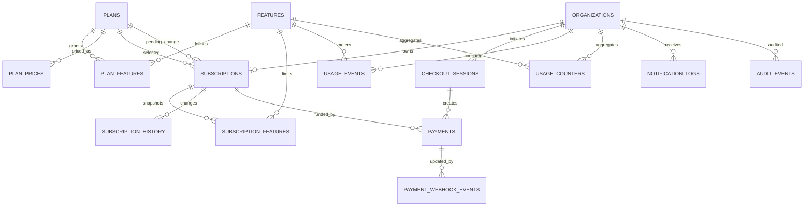
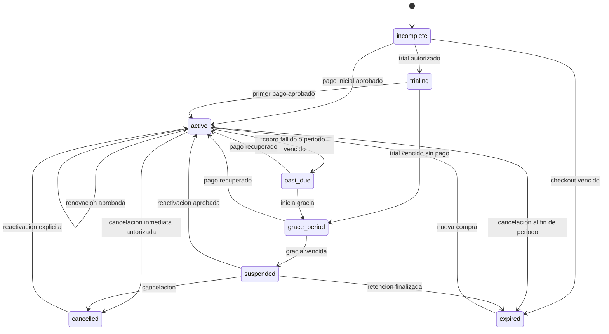

# Fase 2: arquitectura de planes, suscripciones y pagos

**Proyecto:** CommunityManager / SmartTalk  
**Fecha:** 2026-07-29  
**Estado:** propuesta para revision; no autoriza implementacion ni cambios en produccion  
**Titular comercial:** `smarttalk.organizations` (una suscripcion por agencia)

## 1. Objetivo y decisiones rectoras

La capa comercial debe incorporarse como un dominio separado de mensajeria,
Meta, WhatsApp, Instagram, IA y CRM. Los modulos existentes consultan una unica
interfaz de acceso; no conocen detalles de Wompi, PayU, precios ni estados de
webhook.

Decisiones:

1. La agencia, no el usuario ni la marca, es propietaria de la suscripcion.
2. Una organizacion tiene como maximo una suscripcion vigente.
3. Un plan publicado es inmutable. Un cambio crea una nueva version.
4. Los montos se guardan como enteros en unidades menores, nunca `float`.
5. El backend es la autoridad. El frontend solo representa el resultado.
6. El redirect del navegador nunca activa una suscripcion.
7. Solo un webhook autentico o una conciliacion con la pasarela confirma pagos.
8. Los eventos de proveedor son durables, idempotentes y procesables de nuevo.
9. Los webhooks entrantes de mensajeria nunca se bloquean por facturacion.
10. La suspension limita acciones de valor, pero conserva datos, login,
    recepcion de mensajes y acceso a facturacion.
11. No se almacenan PAN, CVV, fecha de tarjeta ni credenciales bancarias.
12. El primer despliegue usa `off`; despues `observe`; finalmente `hard`.

## 2. Contextos y componentes

```text
Frontend Next.js
  |
  | HTTPS + sesion Supabase
  v
API / Server Actions
  |
  +--> Auth / Organization Context
  +--> PlanAccessService
  +--> SubscriptionService
  +--> PaymentService
  +--> NotificationService
  |
  +--> PaymentGatewayInterface
          |--> WompiGateway
          `--> PayUGateway
  |
  v
PostgreSQL / Supabase
  |--> catalogo y precios
  |--> suscripciones e historial
  |--> pagos y checkout
  |--> webhook inbox
  |--> consumo y decisiones
  `--> outbox, notificaciones y auditoria

Wompi / PayU
  |
  `--> Webhook publico --> verificacion --> inbox durable --> worker
```

## 3. Diagrama logico



## 4. Convenciones de datos

- Esquema recomendado: `smarttalk`.
- Claves primarias: `UUID DEFAULT gen_random_uuid()`.
- Fechas: `TIMESTAMPTZ` en UTC.
- Monedas: ISO-4217 en mayusculas; inicialmente `COP`.
- Montos: `BIGINT amount_minor`, mayor o igual a cero.
- Codigos internos: `TEXT` en `snake.case`, no traducidos.
- Datos de proveedor: JSONB sanitizado, sin datos PCI.
- Borrado: archivado logico para catalogos; historial financiero inmutable.
- Toda tabla mutable usa `created_at`, `updated_at` y, cuando aplique, `version`.
- Operaciones criticas usan transaccion, bloqueo de fila y version optimista.

## 5. Modelo de datos propuesto

### 5.1 `plans`

Version inmutable de una oferta comercial.

| Campo | Tipo | Obligatorio | Relacion / valores | Restriccion |
|---|---|---:|---|---|
| `id` | UUID | Si | PK | `DEFAULT gen_random_uuid()` |
| `code` | TEXT | Si | Codigo estable, ej. `professional` | No vacio |
| `version` | INT | Si | Version positiva | `version > 0` |
| `name` | TEXT | Si | Nombre visible | 1-120 caracteres |
| `description` | TEXT | No | Texto comercial | Maximo definido por aplicacion |
| `status` | TEXT | Si | `draft`, `active`, `archived` | CHECK |
| `is_public` | BOOLEAN | Si | Visible para compra | Default `false` |
| `trial_days` | INT | Si | Dias de prueba | `0..365` |
| `grace_days` | INT | Si | Gracia por defecto | `0..30` |
| `metadata` | JSONB | Si | Presentacion, orden, etiquetas | Default `{}` |
| `published_at` | TIMESTAMPTZ | No | Fecha de publicacion | Requerido si `active` |
| `created_by` | UUID | No | FK `auth.users(id)` | `ON DELETE SET NULL` |
| `created_at` | TIMESTAMPTZ | Si | Auditoria | Default `now()` |
| `updated_at` | TIMESTAMPTZ | Si | Auditoria | Trigger |

Indices y reglas:

- `UNIQUE(code, version)`.
- Indice parcial `(code) WHERE status='active'`.
- Solo una version activa y publica por `code`.
- Una version `active` no se edita; se clona y aumenta `version`.
- No se elimina si tiene suscripciones, pagos o historial.

### 5.2 `features`

Catalogo global de capacidades medibles.

| Campo | Tipo | Obligatorio | Relacion / valores | Restriccion |
|---|---|---:|---|---|
| `code` | TEXT | Si | PK, ej. `brands.total` | Patron interno |
| `name` | TEXT | Si | Nombre visible | No vacio |
| `description` | TEXT | No | Definicion funcional | |
| `value_type` | TEXT | Si | `boolean`, `quantity`, `metered`, `storage`, `enum` | CHECK |
| `unit` | TEXT | No | `brands`, `messages`, `bytes` | |
| `default_reset_interval` | TEXT | Si | `none`, `day`, `month`, `billing_period` | CHECK |
| `is_active` | BOOLEAN | Si | Disponible en catalogo | Default `true` |
| `created_at` | TIMESTAMPTZ | Si | Auditoria | Default `now()` |
| `updated_at` | TIMESTAMPTZ | Si | Auditoria | Trigger |

Indices y reglas:

- PK en `code`.
- `code` no se reutiliza con otro significado.
- Un feature archivado se conserva para interpretar snapshots antiguos.

### 5.3 `plan_features`

Beneficio o limite de un feature dentro de una version de plan.

| Campo | Tipo | Obligatorio | Relacion / valores | Restriccion |
|---|---|---:|---|---|
| `id` | UUID | Si | PK | |
| `plan_id` | UUID | Si | FK `plans(id)` | `ON DELETE RESTRICT` |
| `feature_code` | TEXT | Si | FK `features(code)` | `ON DELETE RESTRICT` |
| `enabled` | BOOLEAN | Si | Capacidad habilitada | Default `true` |
| `limit_value` | BIGINT | No | `NULL` significa ilimitado | `>= 0` |
| `enum_value` | TEXT | No | Valor cuando tipo `enum` | |
| `reset_interval` | TEXT | Si | `none`, `day`, `month`, `billing_period` | CHECK |
| `overage_policy` | TEXT | Si | `block`, `notify`, `allow` | CHECK |
| `created_at` | TIMESTAMPTZ | Si | Auditoria | |
| `updated_at` | TIMESTAMPTZ | Si | Auditoria | |

Indices y reglas:

- `UNIQUE(plan_id, feature_code)`.
- Indice `(feature_code, plan_id)`.
- `boolean`: `limit_value` y `enum_value` deben ser `NULL`.
- `quantity`, `metered`, `storage`: `enum_value` debe ser `NULL`.
- `enum`: `enum_value` requerido.
- `enabled=false` implica acceso denegado independientemente del limite.

### 5.4 `plan_prices`

Precio versionado por moneda, intervalo y pasarela.

| Campo | Tipo | Obligatorio | Relacion / valores | Restriccion |
|---|---|---:|---|---|
| `id` | UUID | Si | PK | |
| `plan_id` | UUID | Si | FK `plans(id)` | `ON DELETE RESTRICT` |
| `currency` | CHAR(3) | Si | Inicialmente `COP` | ISO-4217 |
| `amount_minor` | BIGINT | Si | Precio total | `> 0` para pagos |
| `billing_interval` | TEXT | Si | `month`, `year` | CHECK |
| `interval_count` | INT | Si | Multiplicador | `> 0` |
| `gateway` | TEXT | Si | `wompi`, `payu`, `epayco`, `manual` | CHECK/configurable |
| `provider_price_id` | TEXT | No | ID remoto si existe | |
| `is_active` | BOOLEAN | Si | Precio comprable | Default `false` |
| `active_from` | TIMESTAMPTZ | Si | Inicio vigencia | |
| `active_to` | TIMESTAMPTZ | No | Fin vigencia | Mayor que inicio |
| `created_at` | TIMESTAMPTZ | Si | Auditoria | |

Indices y reglas:

- Unico activo por `(plan_id, currency, billing_interval, interval_count,
  gateway)` mediante indice parcial.
- El checkout copia monto y moneda; nunca recalcula desde el frontend.
- Un precio utilizado no se edita: se cierra y se crea otro.

### 5.5 `subscriptions`

Estado actual de la relacion comercial de una agencia.

| Campo | Tipo | Obligatorio | Relacion / valores | Restriccion |
|---|---|---:|---|---|
| `id` | UUID | Si | PK | |
| `organization_id` | UUID | Si | FK `organizations(id)` | `ON DELETE RESTRICT` |
| `plan_id` | UUID | Si | FK `plans(id)` | Version contratada |
| `plan_price_id` | UUID | No | FK `plan_prices(id)` | |
| `pending_plan_id` | UUID | No | FK `plans(id)` | Cambio programado |
| `pending_plan_price_id` | UUID | No | FK `plan_prices(id)` | |
| `status` | TEXT | Si | Maquina de estados | CHECK |
| `gateway` | TEXT | No | `wompi`, `payu`, `epayco`, `manual` | |
| `provider_subscription_id` | TEXT | No | ID remoto | Nunca secreto |
| `provider_customer_id` | TEXT | No | Cliente remoto | Nunca PAN |
| `provider_payment_source_id` | TEXT | No | Fuente tokenizada | Cifrado si contrato lo exige |
| `current_period_start` | TIMESTAMPTZ | No | Periodo vigente | |
| `current_period_end` | TIMESTAMPTZ | No | Fin exclusivo | Mayor que inicio |
| `trial_ends_at` | TIMESTAMPTZ | No | Fin trial | |
| `grace_ends_at` | TIMESTAMPTZ | No | Fin gracia | |
| `next_billing_at` | TIMESTAMPTZ | No | Proximo intento | |
| `change_effective_at` | TIMESTAMPTZ | No | Cambio de plan | |
| `cancel_at_period_end` | BOOLEAN | Si | Cancelacion programada | Default `false` |
| `cancelled_at` | TIMESTAMPTZ | No | Cancelacion efectiva | |
| `suspended_at` | TIMESTAMPTZ | No | Suspension efectiva | |
| `status_reason` | TEXT | No | Codigo interno | No texto sensible |
| `failed_payment_attempts` | INT | Si | Reintentos consecutivos | `>= 0` |
| `version` | INT | Si | Bloqueo optimista | `> 0` |
| `created_at` | TIMESTAMPTZ | Si | Auditoria | |
| `updated_at` | TIMESTAMPTZ | Si | Auditoria | |

Estados permitidos:

- `incomplete`: creada, falta pago o autorizacion.
- `trialing`: prueba vigente.
- `active`: servicio vigente.
- `past_due`: periodo vencido o cobro fallido; esperando recuperacion.
- `grace_period`: acceso temporal controlado hasta `grace_ends_at`.
- `suspended`: acciones comerciales bloqueadas.
- `cancelled`: cancelacion efectiva.
- `expired`: termino sin renovacion.

Indices y reglas:

- `UNIQUE(organization_id)` para el registro actual.
- Indices `(status, next_billing_at)`, `(status, current_period_end)` y
  `(gateway, provider_subscription_id)`.
- `cancelled` y `expired` son terminales salvo reactivacion explicita, que crea
  o transiciona mediante comando auditado.
- Una organizacion nunca cambia de plan por editar el catalogo.

### 5.6 `subscription_features`

Snapshot de beneficios de la suscripcion. Evita que una edicion futura del plan
modifique contratos vigentes.

| Campo | Tipo | Obligatorio | Relacion / valores | Restriccion |
|---|---|---:|---|---|
| `subscription_id` | UUID | Si | FK `subscriptions(id)` | `ON DELETE RESTRICT` |
| `feature_code` | TEXT | Si | FK `features(code)` | |
| `enabled` | BOOLEAN | Si | Snapshot | |
| `limit_value` | BIGINT | No | Snapshot | `>=0` |
| `enum_value` | TEXT | No | Snapshot | |
| `reset_interval` | TEXT | Si | Snapshot | CHECK |
| `overage_policy` | TEXT | Si | Snapshot | CHECK |
| `effective_from` | TIMESTAMPTZ | Si | Inicio | |
| `effective_to` | TIMESTAMPTZ | No | Fin | |
| `created_at` | TIMESTAMPTZ | Si | Auditoria | |

Indices y reglas:

- PK compuesta `(subscription_id, feature_code, effective_from)`.
- Indice parcial para snapshot actual donde `effective_to IS NULL`.
- Cambiar plan cierra snapshot actual y crea otro en la misma transaccion.

### 5.7 `subscription_history`

Historial inmutable de transiciones.

| Campo | Tipo | Obligatorio | Relacion / valores | Restriccion |
|---|---|---:|---|---|
| `id` | UUID | Si | PK | |
| `subscription_id` | UUID | Si | FK `subscriptions(id)` | `ON DELETE RESTRICT` |
| `organization_id` | UUID | Si | FK `organizations(id)` | Desnormalizado para consulta |
| `event_type` | TEXT | Si | `created`, `activated`, `renewed`, `plan_change_scheduled`, `plan_changed`, `past_due`, `grace_started`, `suspended`, `reactivated`, `cancel_scheduled`, `cancelled`, `expired`, `payment_recovered`, `admin_override` | CHECK/catalogo |
| `from_status` | TEXT | No | Estado anterior | |
| `to_status` | TEXT | Si | Estado nuevo | |
| `from_plan_id` | UUID | No | FK `plans(id)` | |
| `to_plan_id` | UUID | No | FK `plans(id)` | |
| `reason_code` | TEXT | No | Motivo interno | |
| `actor_type` | TEXT | Si | `system`, `user`, `admin`, `gateway` | CHECK |
| `actor_id` | UUID | No | Usuario si aplica | |
| `correlation_id` | UUID | Si | Une request, pago y notificacion | |
| `metadata` | JSONB | Si | Datos no sensibles | Default `{}` |
| `occurred_at` | TIMESTAMPTZ | Si | Fecha del evento | Default `now()` |

Indices y reglas:

- Indices `(subscription_id, occurred_at DESC)`,
  `(organization_id, occurred_at DESC)` y `(correlation_id)`.
- Solo `INSERT`; sin `UPDATE` ni `DELETE` para roles de aplicacion.

### 5.8 `checkout_sessions`

Intencion de compra creada antes de redirigir o abrir el widget.

| Campo | Tipo | Obligatorio | Relacion / valores | Restriccion |
|---|---|---:|---|---|
| `id` | UUID | Si | PK | |
| `reference` | TEXT | Si | Referencia interna opaca | UNIQUE |
| `organization_id` | UUID | Si | FK `organizations(id)` | |
| `plan_id` | UUID | Si | FK `plans(id)` | |
| `plan_price_id` | UUID | Si | FK `plan_prices(id)` | |
| `initiated_by` | UUID | Si | FK `auth.users(id)` | |
| `gateway` | TEXT | Si | `wompi`, `payu`, `epayco` | |
| `status` | TEXT | Si | `created`, `opened`, `pending`, `approved`, `declined`, `failed`, `expired`, `cancelled` | CHECK |
| `amount_minor` | BIGINT | Si | Snapshot | `>0` |
| `currency` | CHAR(3) | Si | Snapshot | |
| `environment` | TEXT | Si | `sandbox`, `production` | CHECK |
| `idempotency_key` | TEXT | Si | Clave de solicitud | UNIQUE por organizacion |
| `expires_at` | TIMESTAMPTZ | Si | Expiracion | Mayor a creacion |
| `completed_at` | TIMESTAMPTZ | No | Finalizacion | |
| `created_at` | TIMESTAMPTZ | Si | Auditoria | |
| `updated_at` | TIMESTAMPTZ | Si | Auditoria | |

Indices:

- `(organization_id, created_at DESC)`.
- `(status, expires_at)`.
- `UNIQUE(organization_id, idempotency_key)`.

### 5.9 `payments`

Un intento financiero. Una renovacion puede tener varios intentos.

| Campo | Tipo | Obligatorio | Relacion / valores | Restriccion |
|---|---|---:|---|---|
| `id` | UUID | Si | PK | |
| `organization_id` | UUID | Si | FK `organizations(id)` | |
| `subscription_id` | UUID | No | FK `subscriptions(id)` | |
| `checkout_session_id` | UUID | No | FK `checkout_sessions(id)` | |
| `gateway` | TEXT | Si | `wompi`, `payu`, `epayco`, `manual` | CHECK |
| `environment` | TEXT | Si | `sandbox`, `production` | CHECK |
| `provider_transaction_id` | TEXT | No | ID de pasarela | |
| `merchant_reference` | TEXT | Si | Referencia interna | |
| `attempt_number` | INT | Si | Intento de renovacion | `>0` |
| `purpose` | TEXT | Si | `initial`, `renewal`, `upgrade`, `reactivation`, `manual` | CHECK |
| `status` | TEXT | Si | Estado normalizado | CHECK |
| `provider_status` | TEXT | No | Estado original | |
| `amount_minor` | BIGINT | Si | Monto esperado | `>0` |
| `currency` | CHAR(3) | Si | Moneda esperada | |
| `payment_method_type` | TEXT | No | `card`, `pse`, `nequi`, etc. | No datos sensibles |
| `failure_code` | TEXT | No | Codigo normalizado | |
| `failure_message` | TEXT | No | Mensaje sanitizado | |
| `approved_at` | TIMESTAMPTZ | No | Aprobacion | |
| `expires_at` | TIMESTAMPTZ | No | Pago pendiente | |
| `refunded_amount_minor` | BIGINT | Si | Total reembolsado | `0..amount_minor` |
| `raw_response` | JSONB | Si | Respuesta sanitizada | Default `{}` |
| `created_at` | TIMESTAMPTZ | Si | Auditoria | |
| `updated_at` | TIMESTAMPTZ | Si | Auditoria | |

Estados permitidos:

- `created`
- `pending`
- `approved`
- `declined`
- `failed`
- `expired`
- `voided`
- `partially_refunded`
- `refunded`

Indices y reglas:

- `UNIQUE(gateway, environment, provider_transaction_id)` cuando no sea `NULL`.
- `UNIQUE(gateway, environment, merchant_reference, attempt_number)`.
- Indices `(subscription_id, created_at DESC)`,
  `(organization_id, created_at DESC)` y `(status, expires_at)`.
- `approved` requiere identificador de proveedor y `approved_at`.
- Estado financiero no retrocede de final a pendiente.
- Aprobaciones con monto, moneda, referencia o ambiente distintos se rechazan.

### 5.10 `payment_webhook_events`

Inbox durable de eventos recibidos.

| Campo | Tipo | Obligatorio | Relacion / valores | Restriccion |
|---|---|---:|---|---|
| `id` | UUID | Si | PK | |
| `gateway` | TEXT | Si | `wompi`, `payu`, `epayco` | |
| `environment` | TEXT | Si | `sandbox`, `production` | |
| `provider_event_id` | TEXT | No | ID de evento | |
| `provider_transaction_id` | TEXT | No | ID de transaccion | |
| `event_type` | TEXT | Si | Tipo original | |
| `deduplication_key` | TEXT | Si | Hash/ID estable | |
| `signature_valid` | BOOLEAN | Si | Resultado criptografico | |
| `payload_hash` | TEXT | Si | SHA-256 canonico | |
| `payload` | JSONB | Si | Payload sanitizado | |
| `headers` | JSONB | Si | Lista permitida | Sin secretos/cookies |
| `processing_status` | TEXT | Si | `received`, `processing`, `processed`, `retry`, `dead_letter`, `ignored`, `invalid` | CHECK |
| `attempt_count` | INT | Si | Intentos worker | `>=1` |
| `next_attempt_at` | TIMESTAMPTZ | No | Backoff | |
| `locked_at` | TIMESTAMPTZ | No | Lease worker | |
| `last_error_code` | TEXT | No | Error normalizado | |
| `last_error_message` | TEXT | No | Error sanitizado | |
| `received_at` | TIMESTAMPTZ | Si | Recepcion | |
| `processed_at` | TIMESTAMPTZ | No | Finalizacion | |

Indices y reglas:

- `UNIQUE(gateway, environment, deduplication_key)`.
- Indices `(processing_status, next_attempt_at)` y
  `(provider_transaction_id, received_at DESC)`.
- Firma invalida se registra como `invalid` sin aplicar efectos.
- Un evento repetido responde 2xx pero no vuelve a aplicar la transicion.
- Despues de N intentos pasa a `dead_letter` y genera alerta.

### 5.11 `usage_events`

Evento inmutable de consumo.

| Campo | Tipo | Obligatorio | Relacion / valores | Restriccion |
|---|---|---:|---|---|
| `id` | UUID | Si | PK | |
| `organization_id` | UUID | Si | FK `organizations(id)` | |
| `subscription_id` | UUID | Si | FK `subscriptions(id)` | |
| `feature_code` | TEXT | Si | FK `features(code)` | |
| `quantity` | BIGINT | Si | Consumo positivo | `>0` |
| `period_start` | TIMESTAMPTZ | Si | Periodo | |
| `period_end` | TIMESTAMPTZ | Si | Periodo | Mayor a inicio |
| `idempotency_key` | TEXT | Si | Origen unico | |
| `source_type` | TEXT | No | `message`, `post`, etc. | |
| `source_id` | TEXT | No | ID del recurso | |
| `metadata` | JSONB | Si | No sensible | `{}` |
| `created_at` | TIMESTAMPTZ | Si | Auditoria | |

Indices:

- `UNIQUE(organization_id, feature_code, idempotency_key)`.
- `(organization_id, feature_code, period_start)`.

### 5.12 `usage_counters`

Proyeccion atomica para decidir limites sin recorrer eventos.

| Campo | Tipo | Obligatorio | Relacion / valores | Restriccion |
|---|---|---:|---|---|
| `organization_id` | UUID | Si | FK `organizations(id)` | |
| `subscription_id` | UUID | Si | FK `subscriptions(id)` | |
| `feature_code` | TEXT | Si | FK `features(code)` | |
| `period_start` | TIMESTAMPTZ | Si | PK parcial | |
| `period_end` | TIMESTAMPTZ | Si | Periodo | |
| `quantity` | BIGINT | Si | Acumulado | `>=0` |
| `updated_at` | TIMESTAMPTZ | Si | Auditoria | |

Reglas:

- PK `(organization_id, feature_code, period_start)`.
- Se actualiza en la misma transaccion que inserta `usage_events`.
- Tarea nocturna reconcilia contador contra eventos.

### 5.13 `notification_logs`

Registro de toda comunicacion comercial.

| Campo | Tipo | Obligatorio | Relacion / valores | Restriccion |
|---|---|---:|---|---|
| `id` | UUID | Si | PK | |
| `organization_id` | UUID | Si | FK `organizations(id)` | |
| `subscription_id` | UUID | No | FK `subscriptions(id)` | |
| `payment_id` | UUID | No | FK `payments(id)` | |
| `channel` | TEXT | Si | `email`, `in_app`, `whatsapp` | CHECK |
| `template_code` | TEXT | Si | Plantilla versionada | |
| `recipient_agent_id` | UUID | No | FK `agents(id)` | Destinatario interno |
| `recipient_address_ciphertext` | BYTEA | No | Direccion externa cifrada | Nunca texto plano en logs |
| `recipient_hash` | TEXT | Si | Hash para trazabilidad | No exponer PII |
| `provider_message_id` | TEXT | No | ID del proveedor | |
| `status` | TEXT | Si | `queued`, `sent`, `delivered`, `failed`, `suppressed` | CHECK |
| `idempotency_key` | TEXT | Si | Evita duplicados | |
| `attempt_count` | INT | Si | Intentos | `>=0` |
| `next_attempt_at` | TIMESTAMPTZ | No | Reintento | |
| `failure_code` | TEXT | No | Error | |
| `metadata` | JSONB | Si | Variables no sensibles | |
| `created_at` | TIMESTAMPTZ | Si | Auditoria | |
| `sent_at` | TIMESTAMPTZ | No | Envio | |
| `delivered_at` | TIMESTAMPTZ | No | Entrega | |

Indices:

- `UNIQUE(channel, idempotency_key)`.
- `(status, next_attempt_at)`.
- `(organization_id, created_at DESC)`.
- Debe existir `recipient_agent_id` o `recipient_address_ciphertext`.

### 5.14 `audit_events`

Auditoria general para acciones administrativas y financieras.

| Campo | Tipo | Obligatorio | Relacion / valores | Restriccion |
|---|---|---:|---|---|
| `id` | UUID | Si | PK | |
| `organization_id` | UUID | No | FK `organizations(id)` | |
| `actor_type` | TEXT | Si | `user`, `admin`, `system`, `gateway` | |
| `actor_id` | UUID | No | Usuario | |
| `action` | TEXT | Si | Codigo estable | |
| `entity_type` | TEXT | Si | Tabla/dominio | |
| `entity_id` | TEXT | Si | ID afectado | |
| `correlation_id` | UUID | Si | Traza distribuida | |
| `request_id` | TEXT | No | Request HTTP | |
| `ip_hash` | TEXT | No | Hash con retencion limitada | |
| `user_agent_hash` | TEXT | No | Hash | |
| `before` | JSONB | No | Campos permitidos | Sin secretos |
| `after` | JSONB | No | Campos permitidos | Sin secretos |
| `result` | TEXT | Si | `success`, `denied`, `failed` | |
| `created_at` | TIMESTAMPTZ | Si | Inmutable | |

Indices:

- `(organization_id, created_at DESC)`.
- `(entity_type, entity_id, created_at DESC)`.
- `(correlation_id)`.
- Solo insercion para aplicacion; retencion definida legalmente.

### 5.15 Compatibilidad con el esquema ya preparado

La arquitectura es canonica, pero no exige renombrar inmediatamente tablas ya
creadas. La adopcion debe decidir entre conservar nombres fisicos y exponer
repositorios con nombres de dominio, o realizar una migracion controlada.

| Nombre canonico | Nombre existente/preparado | Decision compatible |
|---|---|---|
| `features` | `feature_catalog` | Puede conservarse fisicamente |
| `plan_features` | `plan_entitlements` | Puede conservarse fisicamente |
| `subscription_history` | `subscription_events` | Agregar campos faltantes |
| `payment_webhook_events` | `billing_webhook_events` | Agregar inbox/retry/dead-letter |
| `usage_events` | `usage_events` | Extender con `subscription_id` |
| `usage_counters` | `usage_counters` | Extender con `subscription_id` |
| `notification_logs` | No existe | Nueva tabla aditiva |
| `audit_events` | Logs parciales | Nueva tabla financiera inmutable |

Compatibilidad de pasarela:

- Los registros `epayco` existentes se conservan.
- Un futuro `EpaycoGateway` puede implementar la misma interfaz durante la
  transicion.
- Elegir Wompi o PayU no obliga a reescribir pagos historicos.
- `gateway` y `environment` forman parte de todas las claves de idempotencia
  para impedir cruces entre proveedores y ambientes.
- No se debe ejecutar un renombrado destructivo en la primera migracion.

## 6. Maquina de estados de suscripcion



Reglas:

- Cada transicion se ejecuta en una transaccion SQL.
- Se bloquea la fila de suscripcion (`FOR UPDATE`) o se valida `version`.
- Se crea `subscription_history` y outbox en la misma transaccion.
- Jobs y webhooks pueden repetir comandos sin repetir efectos.

## 7. Sistema de limites y beneficios

### 7.1 Tipos

- Booleano: acceso a IA o reportes.
- Cantidad actual: usuarios, marcas, canales, contactos, flujos.
- Medido por periodo: mensajes, publicaciones, broadcasts, solicitudes IA.
- Almacenamiento: bytes ocupados.
- Enum: nivel de soporte o profundidad de reportes.

### 7.2 Decision de acceso

Entrada:

```text
organization_id
feature_code
requested_units
idempotency_key opcional
source
```

Resultado:

```text
allowed
mode: off | observe | soft | hard
reason_code
current_usage
limit_value
period_start
period_end
decision_id
```

Algoritmo:

1. Resolver organizacion autenticada desde servidor.
2. Obtener suscripcion actual y snapshot de beneficios.
3. Evaluar estado:
   - `active` y `trialing`: acceso normal.
   - `past_due` y `grace_period`: politica de gracia.
   - `suspended`, `cancelled`, `expired`: solo allowlist esencial.
4. Verificar `enabled`.
5. Obtener conteo transaccional o contador de periodo.
6. Comparar `current + requested` contra limite.
7. Aplicar `overage_policy` y modo de enforcement.
8. Registrar decision si modo no es `off`.
9. Para consumo medido, reservar/registrar atomicamente tras exito.

Allowlist durante suspension:

- Login y recuperacion de cuenta.
- Facturacion, pagos y cambio de metodo.
- Recepcion de webhooks de canales.
- Lectura limitada de inbox y exportacion definida por politica.
- Soporte y notificaciones.

Todo endpoint que crea valor comercial usa `PlanAccessService`; ocultar un boton
no reemplaza esta validacion.

## 8. Servicios de dominio

### 8.1 `SubscriptionService`

Responsabilidad: maquina de estados y contratos.

Metodos:

```text
createIncomplete(organizationId, planPriceId, actor)
startTrial(subscriptionId, actor)
activateFromPayment(subscriptionId, paymentId, effectiveAt)
renewFromPayment(subscriptionId, paymentId, period)
schedulePlanChange(subscriptionId, targetPlanPriceId, effectiveAt, actor)
applyScheduledPlanChange(subscriptionId, correlationId)
cancelAtPeriodEnd(subscriptionId, actor, reason)
cancelImmediately(subscriptionId, actor, reason)
markPastDue(subscriptionId, reason, occurredAt)
startGracePeriod(subscriptionId, graceEndsAt, reason)
suspend(subscriptionId, reason)
reactivate(subscriptionId, paymentId, actor)
expire(subscriptionId, reason)
getCurrentForOrganization(organizationId)
getHistory(subscriptionId, pagination)
```

Todos los comandos reciben `correlationId` e `idempotencyKey`.

### 8.2 `PlanAccessService`

Responsabilidad: capacidades, limites y consumo.

Metodos:

```text
checkAccess(context, featureCode, requestedUnits)
assertAccess(context, featureCode, requestedUnits)
recordUsage(context, featureCode, quantity, idempotencyKey, source)
getUsageSummary(organizationId, period)
getEntitlementSnapshot(subscriptionId)
snapshotPlanFeatures(subscriptionId, planId, effectiveAt)
reconcileUsage(organizationId, featureCode, period)
explainDecision(decisionId)
```

`assertAccess` arroja errores de dominio normalizados, no mensajes del proveedor.

### 8.3 `PaymentService`

Responsabilidad: intenciones, intentos, conciliacion y efectos de pagos.

Metodos:

```text
createCheckout(organizationId, planPriceId, actor, idempotencyKey)
createRenewalAttempt(subscriptionId, billingDate, idempotencyKey)
handleVerifiedWebhook(webhookEventId)
applyGatewayTransaction(transactionSnapshot, webhookEventId)
markApproved(paymentId, transactionSnapshot)
markPending(paymentId, transactionSnapshot)
markDeclined(paymentId, transactionSnapshot)
markExpired(paymentId, transactionSnapshot)
refund(paymentId, amountMinor, reason, actor)
reconcilePayment(paymentId)
reconcilePendingPayments(cutoff)
getPaymentHistory(organizationId, pagination)
```

Nunca recibe un monto autorizado por el frontend. Lee el snapshot del checkout.

### 8.4 `PaymentGatewayInterface`

Responsabilidad: aislar Wompi, PayU o una pasarela futura.

```text
interface PaymentGatewayInterface {
  createCheckout(input): Promise<GatewayCheckout>
  createCharge(input): Promise<GatewayTransaction>
  getTransaction(providerTransactionId): Promise<GatewayTransaction>
  tokenizeOrCreatePaymentSource(input): Promise<GatewayPaymentSource>
  refund(input): Promise<GatewayRefund>
  void(input): Promise<GatewayVoid>
  verifyWebhook(request): Promise<VerifiedGatewayEvent>
  normalizeStatus(providerStatus): PaymentStatus
  supports(capability): boolean
}
```

Capacidades:

```text
hosted_checkout
payment_sources
off_session_charge
refund
partial_refund
void
native_subscription
transaction_query
```

Los adaptadores no actualizan suscripciones; solo retornan DTO normalizados.

### 8.5 `NotificationService`

Responsabilidad: notificaciones idempotentes y plantillas.

Metodos:

```text
enqueue(templateCode, recipient, context, idempotencyKey)
send(notificationLogId)
markDelivered(providerMessageId)
retryFailed(limit)
sendPaymentPending(subscriptionId, paymentId)
sendPaymentDeclined(subscriptionId, paymentId)
sendGraceStarted(subscriptionId)
sendSuspended(subscriptionId)
sendReactivated(subscriptionId)
sendRenewalReminder(subscriptionId, daysBefore)
sendCancellationConfirmed(subscriptionId)
```

### 8.6 `SubscriptionExpirationService`

Responsabilidad: tiempo, renovacion y recuperacion.

Metodos:

```text
scheduleRenewals(now, batchSize)
processDueRenewals(now, batchSize)
processExpiredPeriods(now, batchSize)
startDueGracePeriods(now, batchSize)
suspendExpiredGracePeriods(now, batchSize)
applyScheduledPlanChanges(now, batchSize)
finalizeScheduledCancellations(now, batchSize)
expireStaleCheckouts(now, batchSize)
reconcilePendingPayments(now, batchSize)
```

Usa locks con lease o `FOR UPDATE SKIP LOCKED` para ejecucion concurrente.

## 9. Arquitectura de pasarelas

### 9.1 Recomendacion

Primera opcion: **Wompi**, si la operacion inicial es Colombia y COP.

Motivos:

- Montos nativos enteros en centavos.
- Referencia unica por transaccion.
- Sandbox y produccion separados.
- Webhooks firmados.
- Fuentes de pago para cargos posteriores sin almacenar tarjeta.
- Metodos colombianos como tarjeta, PSE y Nequi, sujetos al contrato.

Segunda opcion: **PayU**, mediante `PayUGateway`.

Consideraciones:

- Su integracion antigua de pagos recurrentes esta descontinuada.
- La recurrencia moderna se implementa con tokenizacion y cargos posteriores.
- Tokenizacion requiere acuerdo comercial.
- La URL de confirmacion reporta estados finales y usa reglas especificas de
  firma y redondeo.

No se debe desarrollar contra ambas inicialmente. Se implementa la interfaz,
un adaptador productivo y contract tests reutilizables. El segundo adaptador se
agrega sin cambiar servicios de dominio.

### 9.2 Secretos por ambiente

```text
PAYMENT_GATEWAY=wompi|payu
PAYMENT_ENVIRONMENT=sandbox|production
WOMPI_PUBLIC_KEY
WOMPI_PRIVATE_KEY
WOMPI_INTEGRITY_SECRET
WOMPI_EVENTS_SECRET
PAYU_API_LOGIN
PAYU_API_KEY
PAYU_MERCHANT_ID
PAYU_ACCOUNT_ID
```

Solo las llaves expresamente publicas pueden llegar al navegador. Los secretos
se leen en servidor y se rotan sin migrar datos.

## 10. Flujos funcionales

### 10.1 Compra inicial

1. Admin selecciona precio.
2. Backend autentica usuario, agencia y rol.
3. `PlanAccessService`/catalogo valida plan activo y precio vigente.
4. `PaymentService.createCheckout` crea snapshot e idempotency key.
5. Gateway genera checkout/widget.
6. Usuario paga en pagina alojada/tokenizada.
7. Redirect muestra "procesando"; no activa nada.
8. Gateway envia webhook.
9. Endpoint verifica firma y guarda inbox durable.
10. Worker consulta/normaliza transaccion y valida referencia, monto, moneda y
    ambiente.
11. En transaccion: pago `approved`, suscripcion `active`, snapshot de features,
    historial y outbox.
12. Notificacion confirma activacion.

### 10.2 Renovacion

1. Job selecciona `next_billing_at <= now()` con lock.
2. Crea intento unico para periodo.
3. Si existe fuente de pago autorizada, gateway realiza cargo off-session.
4. `approved`: extiende desde el mayor entre `now` y `current_period_end`.
5. `pending`: conserva estado y programa conciliacion.
6. `declined/failed`: incrementa intentos y pasa a `past_due`.
7. Tras politica definida inicia gracia y notifica.
8. Sin fuente de pago: crea enlace de pago y notifica renovacion manual.

### 10.3 Cambio de plan

Upgrade:

1. Calcular prorrateo exclusivamente en backend.
2. Crear pago de diferencia con snapshot.
3. Aplicar upgrade solo al aprobarse.
4. Cerrar snapshot anterior y crear el nuevo.

Downgrade:

1. Validar que el plan objetivo existe.
2. Guardar `pending_plan_id` y `change_effective_at=current_period_end`.
3. Mantener beneficios actuales hasta esa fecha.
4. En fecha efectiva aplicar plan y notificar excesos existentes.
5. No borrar recursos por superar el nuevo limite; bloquear nuevas altas.

Para la primera version se recomienda deshabilitar prorrateo y aplicar todos
los cambios al siguiente periodo. Reduce disputas y complejidad financiera.

### 10.4 Suspension

1. Gracia vence sin pago aprobado.
2. Job bloquea fila y confirma nuevamente el estado en gateway.
3. Suscripcion pasa a `suspended`.
4. `PlanAccessService` aplica allowlist esencial.
5. Canales permanecen conectados y webhooks entrantes se almacenan.
6. Se registra historial, auditoria y notificacion.

### 10.5 Reactivacion

1. Admin inicia pago de reactivacion.
2. Webhook aprobado confirma monto y referencia.
3. Suscripcion pasa a `active`.
4. Periodo empieza segun politica comercial.
5. Se reinician intentos fallidos y se limpia gracia.
6. Se restauran capacidades sin reconectar canales.

### 10.6 Cancelacion

Al fin del periodo:

1. Guardar `cancel_at_period_end=true`.
2. No generar nuevas renovaciones.
3. Mantener servicio hasta `current_period_end`.
4. Al vencer, pasar a `expired`.

Inmediata:

- Solo administrador autorizado.
- Requiere politica de reembolso explicita.
- No se elimina informacion.
- Pasa a `cancelled` y registra razon.

### 10.7 Vencimiento y gracia

1. Periodo termina sin renovacion aprobada.
2. Suscripcion pasa `past_due`.
3. Si plan/politica tiene gracia, pasa `grace_period`.
4. `grace_ends_at` se fija una sola vez; reintentos no la extienden.
5. Se programan avisos al inicio, antes del fin y al suspender.
6. Pago aprobado durante gracia reactiva inmediatamente.

### 10.8 Pagos pendientes

- No activan ni renuevan.
- Se consultan periodicamente hasta estado final o expiracion.
- Cada cambio crea historial financiero.
- El cliente ve "pago en validacion".
- No se inicia otro intento automatico mientras exista uno pendiente vigente,
  salvo que la pasarela confirme que puede abandonarse.

### 10.9 Pagos rechazados

- Se conservan como intento inmutable.
- Se normaliza `failure_code`.
- No se revoca un periodo ya pagado.
- Renovacion rechazada incrementa contador y aplica calendario de reintentos.
- Se notifica sin exponer detalles antifraude sensibles.

### 10.10 Webhooks duplicados

1. Verificar firma antes de efectos.
2. Derivar `deduplication_key`.
3. Insertar con restriccion unica.
4. Si ya existe y esta procesado, responder 2xx.
5. Si fallo de forma recuperable, programar retry.
6. Procesar transicion con idempotency key del evento.
7. Nunca extender dos veces ni duplicar notificaciones.

## 11. Manejo de errores

Codigos de dominio:

```text
AUTH_REQUIRED
ORG_CONTEXT_REQUIRED
ROLE_FORBIDDEN
PLAN_NOT_AVAILABLE
PLAN_PRICE_NOT_AVAILABLE
SUBSCRIPTION_STATE_CONFLICT
FEATURE_DISABLED
FEATURE_LIMIT_REACHED
PAYMENT_PENDING
PAYMENT_DECLINED
PAYMENT_AMOUNT_MISMATCH
PAYMENT_CURRENCY_MISMATCH
PAYMENT_ENVIRONMENT_MISMATCH
WEBHOOK_SIGNATURE_INVALID
WEBHOOK_DUPLICATE
GATEWAY_TIMEOUT
GATEWAY_UNAVAILABLE
IDEMPOTENCY_CONFLICT
CONCURRENCY_CONFLICT
```

Politica:

- Errores esperados: respuesta 4xx, codigo estable, sin stack.
- Proveedor temporal: 502/503, retry con backoff y jitter.
- Webhook valido guardado: responder rapido; procesar asincrono.
- Firma invalida: 400/401 y alerta por umbral.
- Error desconocido: correlation ID, log estructurado y payload sanitizado.
- Nunca registrar llaves, tokens de pago, cookies, CVV o PAN.
- Circuit breaker opcional para cargos automaticos.

## 12. Endpoints propuestos

### Catalogo y acceso

```text
GET    /api/billing/plans
GET    /api/billing/plans/:planId
GET    /api/billing/subscription
GET    /api/billing/usage
GET    /api/billing/access/:featureCode
GET    /api/billing/payments
```

### Compra y suscripcion

```text
POST   /api/billing/checkouts
GET    /api/billing/checkouts/:id
POST   /api/billing/subscription/change-plan
POST   /api/billing/subscription/cancel
POST   /api/billing/subscription/reactivate
POST   /api/billing/payments/:id/retry
POST   /api/billing/payments/:id/refund        # superadmin
```

### Webhooks

```text
POST   /api/webhooks/payments/wompi
POST   /api/webhooks/payments/payu
```

### Administracion

```text
GET    /api/admin/billing/plans
POST   /api/admin/billing/plans
POST   /api/admin/billing/plans/:id/publish
POST   /api/admin/billing/plans/:id/archive
GET    /api/admin/billing/subscriptions
GET    /api/admin/billing/payments
GET    /api/admin/billing/webhook-events
POST   /api/admin/billing/webhook-events/:id/retry
POST   /api/admin/billing/subscriptions/:id/override
```

Requisitos:

- `Idempotency-Key` obligatorio en mutaciones de pago.
- `X-Correlation-Id` aceptado o generado.
- Paginacion por cursor.
- No aceptar `organization_id`, precio ni monto desde el frontend como
  autoridad.

## 13. Middleware y controles transversales

```text
requireAuth
resolveOrganizationContext
requireOrganizationRole(admin|supervisor|agent)
requireSuperAdmin
requirePlanFeature(featureCode, units)
requireIdempotencyKey
rateLimitByUserAndOrganization
validateJsonBody
validatePaymentWebhookSignature(gateway)
attachCorrelationId
structuredAuditLog
secureHeaders
```

Los webhooks no usan sesion de usuario. Usan firma del proveedor, limite de
tamano, content-type esperado, rate limiting tolerante y allowlist de campos.

## 14. Tareas programadas y cola

### Tareas

```text
Cada 5 minutos: procesar webhook inbox y retries.
Cada 15 minutos: conciliar pagos pendientes.
Cada hora: vencimientos, gracia, suspension y cambios programados.
Diario: recordatorios de renovacion y cancelacion.
Diario: reconciliar contadores de consumo.
Diario: reconciliar transacciones recientes con gateway.
Semanal: detectar eventos dead-letter y discrepancias.
```

### Cola recomendada

Primera etapa:

- Patron inbox/outbox en PostgreSQL.
- Worker por cron.
- Reclamo por `FOR UPDATE SKIP LOCKED`.
- Lease, `attempt_count`, backoff exponencial y dead-letter.

Escala posterior:

- QStash, SQS, Cloud Tasks o equivalente.
- La tabla outbox sigue siendo la garantia transaccional.
- No depender de una promesa en memoria despues de responder HTTP.

## 15. Seguridad y RLS

- `plans`, `features`, `plan_features`, precios activos: lectura autenticada.
- Suscripciones, pagos, uso y notificaciones: lectura solo de la organizacion.
- Escrituras financieras: exclusivamente `service_role` desde backend.
- Superadmin: API de servidor; no RLS permisivo desde navegador.
- Eventos webhook y auditoria: sin lectura para usuarios normales.
- RLS usa `get_agent_org_id()` o equivalente unico y probado.
- Service role nunca se importa en componentes cliente.
- Secretos gestionados por Vercel/Supabase, con rotacion.
- Retencion y minimizacion de payloads conforme a politica legal.

## 16. Estrategia de pruebas

### Unitarias

- Maquina de estados.
- Calculo de periodos y gracia.
- Prorrateo si se habilita.
- Mapeo de estados Wompi/PayU.
- Verificacion de firmas.
- Normalizacion monetaria.
- Decision de features.
- Backoff e idempotencia.

### Contract tests

Misma suite para cada `PaymentGatewayInterface`:

- Crear checkout.
- Consultar transaccion.
- Normalizar aprobado, pendiente, rechazado y expirado.
- Validar firma autentica y rechazar manipulacion.
- Reembolso soportado/no soportado.
- Timeout y respuesta malformada.

### Integracion con PostgreSQL

- Constraints e indices.
- Una suscripcion por organizacion.
- Doble webhook concurrente.
- Doble renovacion concurrente.
- Registro atomico de consumo.
- Snapshot de features.
- RLS entre dos agencias.
- Worker con `SKIP LOCKED`.

### End-to-end

- Compra, redirect y webhook.
- Renovacion aprobada/fallida.
- Cambio de plan.
- Gracia, suspension y reactivacion.
- Cancelacion al final de periodo.
- Mensajeria entrante durante suspension.
- Frontend oculto y llamada API directa bloqueada.

### No funcionales

- Carga de webhooks.
- Recuperacion despues de caida.
- Replay de eventos.
- Rotacion de secretos.
- Restauracion de backup.
- Observabilidad sin PII/PCI.

## 17. Estrategia de despliegue

1. Aprobar esta arquitectura y elegir Wompi o PayU.
2. Crear ADR con politicas comerciales: gracia, reintentos, cambio de plan y
   reembolso.
3. Backup de `public` y `smarttalk`.
4. Migraciones aditivas en staging.
5. Deploy de codigo con `BILLING_ENFORCEMENT_MODE=off`.
6. Backfill auditado de marcas a organizaciones.
7. Pruebas sandbox y regresion multicanal.
8. Activar `observe`.
9. Comparar decisiones durante varios dias.
10. Activar `hard` solo para organizacion piloto.
11. Habilitar produccion de pasarela con limites y alertas.
12. Ampliar gradualmente.

Feature flags independientes:

```text
billing.catalog.enabled
billing.checkout.enabled
billing.webhooks.enabled
billing.renewals.enabled
billing.enforcement.mode
billing.notifications.enabled
```

## 18. Estrategia de reversion

Reversion funcional:

1. `billing.enforcement.mode=off`.
2. Desactivar checkouts y renovaciones.
3. Mantener webhooks activos para no perder confirmaciones.
4. Replegar version de aplicacion.
5. Reconciliar eventos recibidos durante incidente.

Reversion de datos:

- No borrar tablas financieras.
- Migraciones aditivas tienen `down` documentado, pero no se ejecuta si hay
  pagos.
- Restaurar backup solo ante corrupcion y con ventana de mantenimiento.
- Corregir con migracion forward en lugar de reescribir historial.
- Exportar pagos, webhooks, historial y auditoria antes de cualquier rollback.

## 19. Decisiones pendientes para aprobacion

1. Pasarela inicial: recomendada Wompi; alternativa PayU.
2. Renovacion v1: manual por checkout o automatica con fuente tokenizada.
3. Gracia: recomendada 3 dias.
4. Reintentos: recomendados dias 0, 1 y 3.
5. Upgrade: siguiente periodo en v1; prorrateo en fase posterior.
6. Downgrade: siempre al final del periodo.
7. Cancelacion: al final del periodo por defecto.
8. Retencion despues de cancelacion.
9. Politica de reembolsos.
10. Canales de notificacion autorizados.

## 20. Referencias oficiales

- [Wompi: transacciones](https://docs.wompi.co/docs/colombia/transacciones/)
- [Wompi: eventos](https://docs.wompi.co/docs/colombia/eventos/)
- [Wompi: fuentes de pago y tokenizacion](https://docs.wompi.co/docs/colombia/fuentes-de-pago/)
- [PayU: integracion API](https://developers.payulatam.com/latam/es/docs/integrations/api-integration.html)
- [PayU: URL de confirmacion](https://developers.payulatam.com/latam/es/docs/integrations/confirmation-url.html)
- [PayU: API de tokenizacion](https://developers.payulatam.com/latam/es/docs/integrations/api-integration/tokenization-api.html)
- [PayU: recurrencia antigua descontinuada](https://developers.payulatam.com/latam/es/deprecated/recurring-payments.html)
